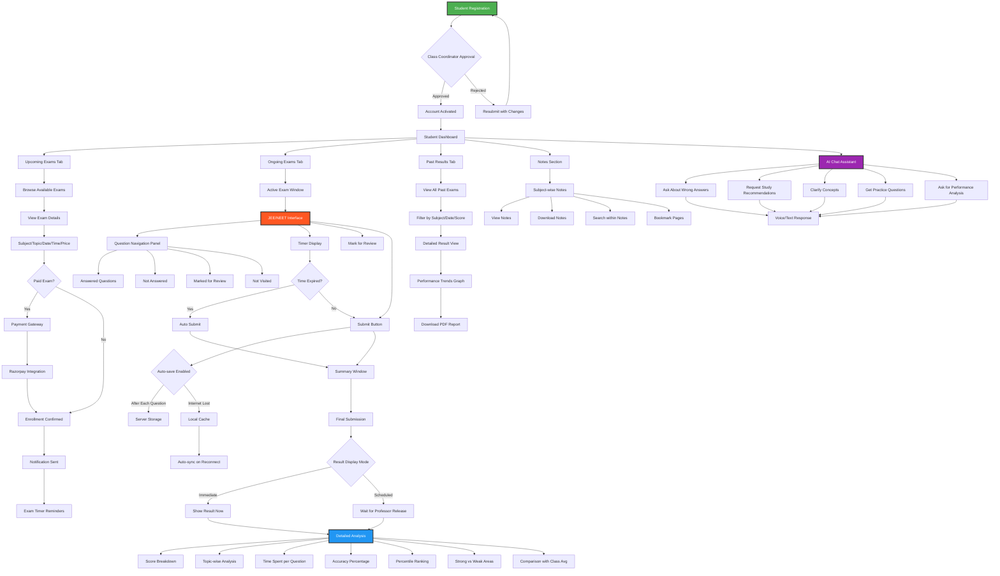
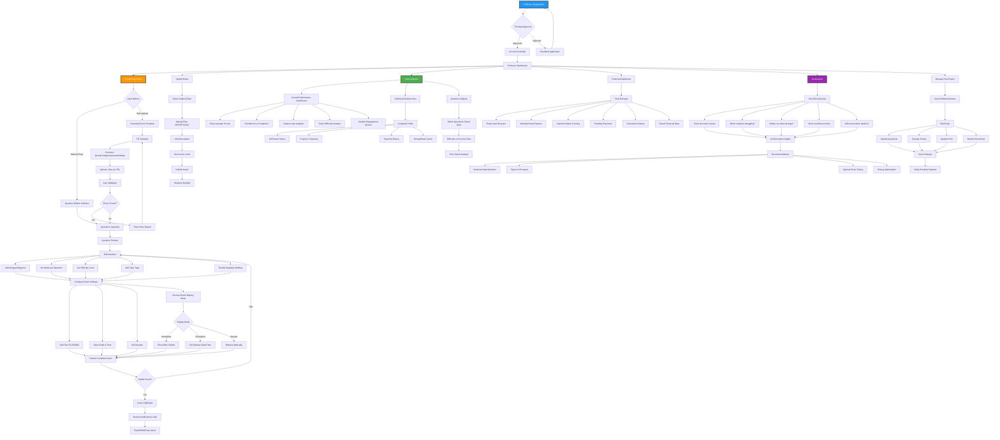
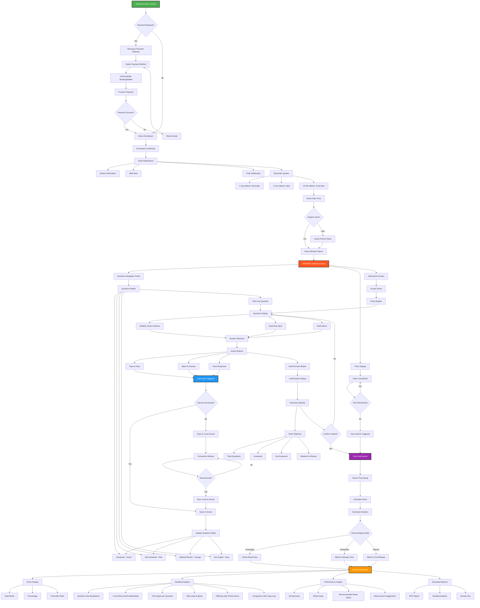
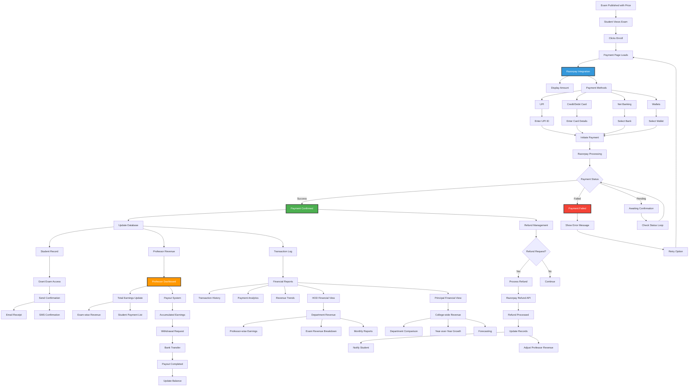
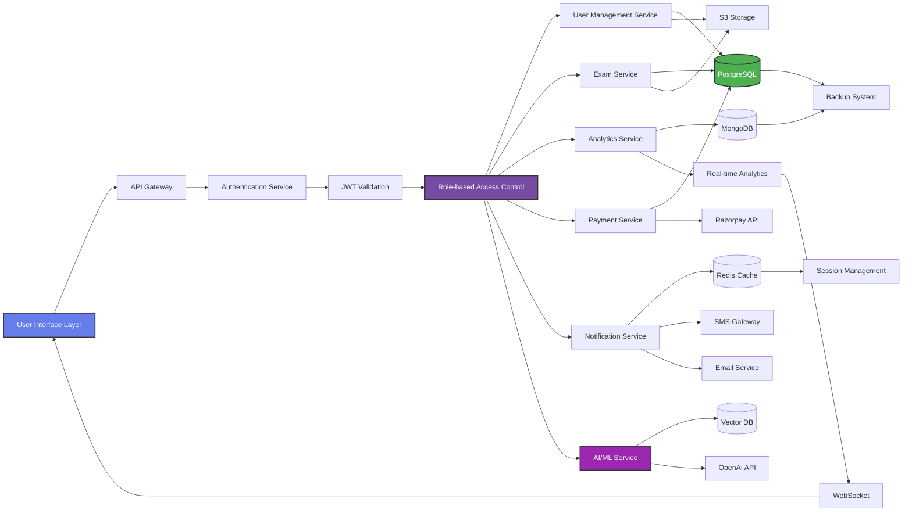

# Smart Exam & Learning Management System - Complete Flowcharts

## 1. Overall System Architecture Flow

```mermaid
graph TB
    Start([System Entry]) --> Login{User Login}
    Login --> Student[Student Portal]
    Login --> Professor[Professor Portal]
    Login --> Coordinator[Class Coordinator Portal]
    Login --> HOD[HOD Portal]
    Login --> Principal[Principal Portal]
    
    Student --> S1[Registration & Approval]
    Student --> S2[Exam Management]
    Student --> S3[Notes Access]
    Student --> S4[Results & Analytics]
    Student --> S5[AI Assistant]
    
    Professor --> P1[Create Exams]
    Professor --> P2[Upload Notes]
    Professor --> P3[View Analytics]
    Professor --> P4[Financial Dashboard]
    Professor --> P5[AI Insights]
    
    Coordinator --> C1[Approve Students]
    Coordinator --> C2[Assign Professors]
    Coordinator --> C3[Class Analytics]
    Coordinator --> C4[Attendance Management]
    Coordinator --> C5[AI Recommendations]
    
    HOD --> H1[Approve Coordinators]
    HOD --> H2[Department Analytics]
    HOD --> H3[Parent Interface]
    HOD --> H4[Resource Management]
    HOD --> H5[AI Strategic Insights]
    
    Principal --> PR1[Approve HOD & Professors]
    Principal --> PR2[College-wide Analytics]
    Principal --> PR3[Strategic Planning]
    Principal --> PR4[Stakeholder Management]
    Principal --> PR5[AI Executive Assistant]
    
    style Start fill:#667eea,stroke:#333,stroke-width:3px,color:#fff
    style Student fill:#4CAF50,stroke:#333,stroke-width:2px,color:#fff
    style Professor fill:#2196F3,stroke:#333,stroke-width:2px,color:#fff
    style Coordinator fill:#FF9800,stroke:#333,stroke-width:2px,color:#fff
    style HOD fill:#9C27B0,stroke:#333,stroke-width:2px,color:#fff
    style Principal fill:#F44336,stroke:#333,stroke-width:2px,color:#fff
```

## 2. Student Complete Flow

## 3. Professor Complete Flow

## 4. Class Coordinator Complete Flow

```mermaid
graph TD
    A[Coordinator Registration] --> B{HOD Approval}
    B -->|Approved| C[Account Activated]
    B -->|Rejected| D[Resubmit]
    D --> A
    
    C --> E[Coordinator Dashboard]
    
    E --> F[Student Management]
    E --> G[Professor Assignment]
    E --> H[Class Analytics]
    E --> I[Attendance Management]
    E --> J[Communication Hub]
    E --> K[AI Assistant]
    
    F --> F1[Pending Student Registrations]
    F1 --> F2[Review Application]
    F2 --> F3[Verify Documents]
    F3 --> F4{Approve/Reject}
    F4 -->|Approve| F5[Activate Student Account]
    F4 -->|Reject| F6[Send Feedback]
    F5 --> F7[Assign to Class/Section]
    F7 --> F8[Student Notification]
    
    F --> F9[Manage Active Students]
    F9 --> F10[View Student Profiles]
    F9 --> F11[Transfer Between Sections]
    F9 --> F12[Update Student Status]
    F9 --> F13[Batch Operations]
    
    G --> G1[View Available Professors]
    G1 --> G2[Assign to Subjects]
    G2 --> G3[Create Teaching Schedule]
    G3 --> G4[Set Workload Distribution]
    G4 --> G5[Professor Notification]
    G5 --> G6[Student Access Updated]
    
    G --> G7[Monitor Assignment]
    G7 --> G8[Professor Performance]
    G8 --> G9[Student Feedback]
    G8 --> G10[Teaching Effectiveness]
    
    H --> H1[Class Performance Overview]
    H1 --> H2[Average Scores by Exam]
    H1 --> H3[Subject-wise Analysis]
    H1 --> H4[Pass/Fail Distribution]
    H1 --> H5[Participation Rates]
    H1 --> H6[Trend Analysis]
    
    H --> H7[Student-level Details]
    H7 --> H8[Individual Progress]
    H8 --> H9[At-risk Students]
    H8 --> H10[Top Performers]
    H8 --> H11[Improvement Tracking]
    
    H --> H12[Comparison Analytics]
    H12 --> H13[Compare with Other Classes]
    H12 --> H14[Year-over-Year Trends]
    H12 --> H15[Subject Benchmarking]
    
    I --> I1[Daily Attendance Marking]
    I1 --> I2[Manual Entry]
    I1 --> I3[Bulk Upload]
    I1 --> I4[Integration with Exams]
    
    I --> I5[Attendance Reports]
    I5 --> I6[Monthly Summary]
    I5 --> I7[Low Attendance Alerts]
    I5 --> I8[Parent Notifications]
    I5 --> I9[Attendance vs Performance]
    
    I --> I10[Leave Management]
    I10 --> I11[Approve Leave Requests]
    I10 --> I12[Track Leave Balance]
    I10 --> I13[Medical Leave Records]
    
    J --> J1[Class Announcements]
    J1 --> J2[Broadcast to All Students]
    J1 --> J3[Email/SMS/Push]
    
    J --> J4[Parent Communication]
    J4 --> J5[Send Progress Reports]
    J4 --> J6[Absence Notifications]
    J4 --> J7[Meeting Scheduling]
    
    J --> J8[Professor Coordination]
    J8 --> J9[Teaching Updates]
    J8 --> J10[Resource Requests]
    J8 --> J11[Feedback Sharing]
    
    K --> K1[AI-Powered Insights]
    K1 --> K2["Where class spending time?"]
    K1 --> K3["Students need intervention?"]
    K1 --> K4["Overall class trends?"]
    
    K2 --> K5[Generate Reports]
    K3 --> K5
    K4 --> K5
    
    K5 --> K6[Recommendations]
    K6 --> K7[Engagement Strategies]
    K6 --> K8[Resource Allocation]
    K6 --> K9[Peer Learning Groups]
    K6 --> K10[Parent Communication Triggers]
    
    style A fill:#FF9800,stroke:#333,stroke-width:3px,color:#fff
    style F fill:#4CAF50,stroke:#333,stroke-width:3px,color:#fff
    style H fill:#2196F3,stroke:#333,stroke-width:3px,color:#fff
    style K fill:#9C27B0,stroke:#333,stroke-width:3px,color:#fff
```

## 5. HOD Complete Flow

```mermaid
graph TD
    A[HOD Registration] --> B{Principal Approval}
    B -->|Approved| C[Account Activated]
    B -->|Rejected| D[Resubmit]
    D --> A
    
    C --> E[HOD Dashboard]
    
    E --> F[Approvals Management]
    E --> G[Department Analytics]
    E --> H[Parent Meeting Interface]
    E --> I[Resource Management]
    E --> J[Strategic Planning]
    E --> K[AI Assistant]
    
    F --> F1[Class Coordinator Approvals]
    F1 --> F2[Review Applications]
    F2 --> F3[Verify Credentials]
    F3 --> F4[Check Experience]
    F4 --> F5{Approve/Reject}
    F5 -->|Approve| F6[Assign Classes]
    F5 -->|Reject| F7[Send Feedback]
    F6 --> F8[Set Permissions]
    F8 --> F9[Coordinator Notification]
    
    F --> F10[Professor Approvals Optional]
    F10 --> F11[Department-level Review]
    F11 --> F12[Subject Assignment]
    F12 --> F13[Workload Distribution]
    F13 --> F14[Final Approval]
    
    G --> G1[All Students Overview]
    G1 --> G2[Department-wide Results]
    G1 --> G3[Year-wise Comparison]
    G1 --> G4[Placement Readiness]
    G1 --> G5[Student Success Rates]
    
    G --> G6[All Professors Analytics]
    G6 --> G7[Teaching Effectiveness]
    G6 --> G8[Student Feedback Scores]
    G6 --> G9[Exam Creation Activity]
    G6 --> G10[Revenue Contribution]
    G6 --> G11[Workload Analysis]
    
    G --> G12[Department Performance]
    G12 --> G13[Trend Analysis]
    G12 --> G14[Cross-subject Comparison]
    G12 --> G15[Benchmark vs Standards]
    G12 --> G16[Success Metrics]
    
    G --> G17[All Test Results]
    G17 --> G18[Exam-wise Statistics]
    G17 --> G19[Difficulty Analysis]
    G17 --> G20[Participation Rates]
    G17 --> G21[Revenue Tracking]
    
    H --> H1[Quick Student Search]
    H1 --> H2[By Name/Roll No/ID]
    H1 --> H3[QR Code Scan]
    H1 --> H4[Instant Profile Load]
    
    H4 --> H5[Result Showcase Dashboard]
    H5 --> H6[All Exam Results Timeline]
    H5 --> H7[Subject-wise Performance Charts]
    H5 --> H8[Comparison with Class Average]
    H5 --> H9[Attendance Correlation]
    H5 --> H10[Strengths & Weaknesses]
    
    H10 --> H11[Improvement Analytics]
    H11 --> H12[Month-over-Month Growth]
    H11 --> H13[Percentile Improvement]
    H11 --> H14[Skill Development Tracking]
    H11 --> H15[Goal Achievement Status]
    
    H15 --> H16[Professional Charts]
    H16 --> H17[Line Graphs - Trends]
    H16 --> H18[Bar Charts - Comparison]
    H16 --> H19[Pie Charts - Distribution]
    H16 --> H20[Heat Maps - Topics]
    
    H20 --> H21[Predictive Insights]
    H21 --> H22[Expected Semester Results]
    H21 --> H23[Areas Need Attention]
    H21 --> H24[Recommended Actions]
    H21 --> H25[Success Probability]
    
    H25 --> H26[Generate Parent Report]
    H26 --> H27[One-Click PDF Export]
    H27 --> H28[Meeting Complete 5 min!]
    
    I --> I1[Faculty Assignment]
    I1 --> I2[Workload Balancing]
    I1 --> I3[Subject-Professor Mapping]
    I1 --> I4[Substitute Management]
    
    I --> I5[Budget Allocation]
    I5 --> I6[Department Budget]
    I5 --> I7[Lab Resources]
    I5 --> I8[Equipment Purchases]
    I5 --> I9[Training Budget]
    
    I --> I10[Infrastructure Planning]
    I10 --> I11[Classroom Utilization]
    I10 --> I12[Lab Scheduling]
    I10 --> I13[Resource Optimization]
    
    J --> J1[Long-term Goals]
    J1 --> J2[KPI Tracking]
    J1 --> J3[Accreditation Prep]
    J1 --> J4[Industry Collaboration]
    J1 --> J5[Research Output]
    
    J --> J6[Recruitment Planning]
    J6 --> J7[Faculty Needs Analysis]
    J6 --> J8[Performance-based Incentives]
    J6 --> J9[Professional Development]
    
    K --> K1[Department AI Assistant]
    K1 --> K2["Show department summary"]
    K1 --> K3["Which professors excelling?"]
    K1 --> K4["Identify struggling students"]
    K1 --> K5["Compare year-over-year"]
    K1 --> K6["Resource allocation tips"]
    
    K2 --> K7[Strategic Analytics]
    K3 --> K7
    K4 --> K7
    K5 --> K7
    K6 --> K7
    
    K7 --> K8[AI Recommendations]
    K8 --> K9[Department Benchmarking]
    K8 --> K10[Faculty Effectiveness Scoring]
    K8 --> K11[Student Success Prediction]
    K8 --> K12[Curriculum Effectiveness]
    
    K --> K13[Parent Convincing AI]
    K13 --> K14[Auto-generate Progress Reports]
    K13 --> K15[Highlight Improvements]
    K13 --> K16[Data-driven Reassurance]
    K13 --> K17[Success Story Identification]
    
    style A fill:#9C27B0,stroke:#333,stroke-width:3px,color:#fff
    style H fill:#FF5722,stroke:#333,stroke-width:3px,color:#fff
    style H28 fill:#4CAF50,stroke:#333,stroke-width:3px,color:#fff
    style K fill:#2196F3,stroke:#333,stroke-width:3px,color:#fff
```

## 6. Principal Complete Flow

```mermaid
graph TD
    A[Principal Login] --> B[Executive Dashboard]
    
    B --> C[Approval System]
    B --> D[College-wide Analytics]
    B --> E[Strategic Planning]
    B --> F[Stakeholder Management]
    B --> G[AI Executive Assistant]
    
    C --> C1[HOD Approvals]
    C1 --> C2[Review Qualification]
    C1 --> C3[Department Assignment]
    C1 --> C4[Authority Delegation]
    C1 --> C5{Approve/Reject}
    C5 -->|Approve| C6[HOD Activated]
    C5 -->|Reject| C7[Feedback & Resubmit]
    
    C --> C8[Professor Approvals]
    C8 --> C9[Final Authority Review]
    C8 --> C10[Cross-department Faculty]
    C8 --> C11[Visiting Faculty]
    C8 --> C12[Workload Approval]
    C8 --> C13{Approve/Reject}
    C13 -->|Approve| C14[Professor Activated]
    C13 -->|Reject| C15[Send Feedback]
    
    C --> C16[Batch Approval Workflows]
    C16 --> C17[Bulk Processing]
    C16 --> C18[Conditional Approvals]
    C16 --> C19[Audit Trail]
    
    D --> D1[Academic Performance]
    D1 --> D2[Overall Pass Percentage]
    D1 --> D3[Department Ranking]
    D1 --> D4[Subject-wise Analysis]
    D1 --> D5[Semester-wise Trends]
    D1 --> D6[Placement Correlation]
    
    D --> D7[Financial Health]
    D7 --> D8[Total Revenue from Exams]
    D7 --> D9[Department-wise Earnings]
    D7 --> D10[Professor Earnings]
    D7 --> D11[Enrollment Trends]
    D7 --> D12[Budget vs Actual]
    D7 --> D13[ROI on Initiatives]
    
    D --> D14[Human Resources]
    D14 --> D15[Total Faculty Overview]
    D14 --> D16[Department Distribution]
    D14 --> D17[Workload Analysis]
    D14 --> D18[Performance Evaluation]
    D14 --> D19[Retention Metrics]
    D14 --> D20[Training Needs]
    
    D --> D21[Quality Metrics]
    D21 --> D22[Teaching Quality]
    D21 --> D23[Infrastructure Utilization]
    D21 --> D24[Student Satisfaction]
    D21 --> D25[Accreditation Scores]
    D21 --> D26[Compliance Status]
    
    E --> E1[Vision & Mission]
    E1 --> E2[Strategic Objectives]
    E1 --> E3[KPI Dashboard]
    E1 --> E4[Goal Tracking]
    E1 --> E5[Milestone Monitoring]
    
    E --> E6[Long-term Planning]
    E6 --> E7[5-year Roadmap]
    E6 --> E8[Expansion Plans]
    E6 --> E9[Infrastructure Development]
    E6 --> E10[Technology Upgrades]
    
    E --> E11[Compliance & Accreditation]
    E11 --> E12[Regulatory Tracking]
    E11 --> E13[Policy Adherence]
    E11 --> E14[Audit Readiness]
    E11 --> E15[Documentation]
    
    F --> F1[Parent Relations]
    F1 --> F2[College-wide Reports]
    F1 --> F3[Meeting Scheduling]
    F1 --> F4[Grievance System]
    F1 --> F5[Feedback Portal]
    
    F --> F6[Industry Partnerships]
    F6 --> F7[Collaboration Tracking]
    F6 --> F8[Placement Coordination]
    F6 --> F9[Internship Management]
    F6 --> F10[MOU Monitoring]
    
    F --> F11[Alumni Network]
    F11 --> F12[Alumni Database]
    F11 --> F13[Success Stories]
    F11 --> F14[Mentorship Programs]
    F11 --> F15[Fundraising]
    
    F --> F16[Media & PR]
    F16 --> F17[Public Communications]
    F16 --> F18[Social Media]
    F16 --> F19[Brand Management]
    F16 --> F20[Crisis Communication]
    
    G --> G1[Voice & Text Queries]
    G1 --> G2["Compare department performance"]
    G1 --> G3["Show college-wide trends"]
    G1 --> G4["Identify top performers"]
    G1 --> G5["Revenue forecast next quarter"]
    G1 --> G6["What needs attention?"]
    G1 --> G7["Benchmark vs peers"]
    
    G2 --> G8[AI Insights Generation]
    G3 --> G8
    G4 --> G8
    G5 --> G8
    G6 --> G8
    G7 --> G8
    
    G8 --> G9[Strategic Recommendations]
    G9 --> G10[Growth Opportunities]
    G9 --> G11[Risk Assessment]
    G9 --> G12[Resource Optimization]
    G9 --> G13[Competitive Positioning]
    G9 --> G14[Innovation Suggestions]
    
    G --> G15[Predictive Analytics]
    G15 --> G16[Enrollment Projections]
    G15 --> G17[Revenue Predictions]
    G15 --> G18[Student Success Rates]
    G15 --> G19[Faculty Requirements]
    G15 --> G20[Infrastructure Needs]
    
    G --> G21[Decision Support]
    G21 --> G22[Policy Impact Simulation]
    G21 --> G23[Investment Prioritization]
    G21 --> G24[Crisis Management]
    G21 --> G25[Expansion Feasibility]
    
    style A fill:#F44336,stroke:#333,stroke-width:4px,color:#fff
    style D fill:#4CAF50,stroke:#333,stroke-width:3px,color:#fff
    style E fill:#2196F3,stroke:#333,stroke-width:3px,color:#fff
    style G fill:#9C27B0,stroke:#333,stroke-width:3px,color:#fff
```

## 7. Exam Conduction Detailed Flow

## 8. Payment & Financial Flow

## 9. AI Features Integration Flow

```mermaid
graph TD
    A[AI System] --> B[Student AI Assistant]
    A --> C[Professor AI Insights]
    A --> D[Coordinator AI Analytics]
    A --> E[HOD AI Strategy]
    A --> F[Principal AI Executive]
    
    B --> B1[Voice/Text Input]
    B1 --> B2["Where did I go wrong?"]
    B1 --> B3["What should I study?"]
    B1 --> B4["Explain this concept"]
    B1 --> B5["Give me practice questions"]
    
    B2 --> B6[Analyze Exam Results]
    B6 --> B7[Identify Wrong Answers]
    B7 --> B8[Explain Correct Answer]
    B7 --> B9[Show Concept Gap]
    B7 --> B10[Recommend Resources]
    
    B3 --> B11[Performance Analysis]
    B11 --> B12[Weak Topics Identification]
    B12 --> B13[Study Plan Generation]
    B13 --> B14[Time Allocation]
    B13 --> B15[Resource Recommendations]
    
    B4 --> B16[NLP Processing]
    B16 --> B17[Concept Clarification]
    B17 --> B18[Simple Explanation]
    B17 --> B19[Examples]
    B17 --> B20[Related Topics]
    
    B5 --> B21[Question Generation]
    B21 --> B22[Based on Weak Areas]
    B22 --> B23[Difficulty Level Match]
    B23 --> B24[Practice Set Creation]
    
    C --> C1[Voice/Text Queries]
    C1 --> C2["Show last exam results"]
    C1 --> C3["Which students struggling?"]
    C1 --> C4["What's my earnings?"]
    C1 --> C5["Which questions hardest?"]
    
    C2 --> C6[Data Retrieval]
    C6 --> C7[Result Analytics]
    C7 --> C8[Performance Metrics]
    C7 --> C9[Visual Charts]
    C7 --> C10[Trends]
    
    C3 --> C11[Student Analysis]
    C11 --> C12[Identify At-risk Students]
    C12 --> C13[Performance Patterns]
    C12 --> C14[Intervention Suggestions]
    C12 --> C15[Action Items]
    
    C4 --> C16[Financial Data]
    C16 --> C17[Total Revenue]
    C16 --> C18[Exam-wise Breakdown]
    C16 --> C19[Trends & Forecasts]
    
    C5 --> C20[Question Analytics]
    C20 --> C21[Success Rate Analysis]
    C21 --> C22[Difficulty Assessment]
    C22 --> C23[Recommendations]
    C23 --> C24[Question Improvement Tips]
    
    D --> D1[Class Insights]
    D1 --> D2["Where class spending time?"]
    D1 --> D3["Students need intervention?"]
    D1 --> D4["Overall class trends?"]
    
    D2 --> D5[Engagement Analysis]
    D5 --> D6[Time Allocation Patterns]
    D6 --> D7[Subject-wise Focus]
    D6 --> D8[Study Habits]
    D6 --> D9[Optimization Tips]
    
    D3 --> D10[Risk Prediction]
    D10 --> D11[Performance Decline Detection]
    D11 --> D12[Attendance Correlation]
    D11 --> D13[Early Warning System]
    D11 --> D14[Action Recommendations]
    
    D4 --> D15[Trend Analysis]
    D15 --> D16[Progress Tracking]
    D16 --> D17[Improvement Areas]
    D16 --> D18[Success Patterns]
    D16 --> D19[Benchmarking]
    
    E --> E1[Department Strategy]
    E1 --> E2["Department performance summary"]
    E1 --> E3["Which professors excelling?"]
    E1 --> E4["Resource allocation tips"]
    
    E2 --> E5[Comprehensive Analytics]
    E5 --> E6[KPI Dashboard]
    E6 --> E7[Department Ranking]
    E6 --> E8[Success Metrics]
    E6 --> E9[Improvement Areas]
    
    E3 --> E10[Faculty Evaluation]
    E10 --> E11[Teaching Effectiveness]
    E11 --> E12[Student Satisfaction]
    E11 --> E13[Innovation Metrics]
    E11 --> E14[Recognition Suggestions]
    
    E4 --> E15[Resource Optimization]
    E15 --> E16[Budget Allocation]
    E16 --> E17[Infrastructure Needs]
    E16 --> E18[Staff Requirements]
    E16 --> E19[Investment Priorities]
    
    E --> E20[Parent Communication AI]
    E20 --> E21[Auto-generate Reports]
    E21 --> E22[Highlight Improvements]
    E21 --> E23[Data Visualization]
    E21 --> E24[Talking Points]
    
    F --> F1[Executive Queries]
    F1 --> F2["Compare departments"]
    F1 --> F3["College-wide trends"]
    F1 --> F4["Revenue forecast"]
    F1 --> F5["What needs attention?"]
    
    F2 --> F6[Comparative Analysis]
    F6 --> F7[Department Benchmarking]
    F7 --> F8[Strengths & Weaknesses]
    F7 --> F9[Best Practices]
    F7 --> F10[Recommendations]
    
    F3 --> F11[Institutional Analytics]
    F11 --> F12[Enrollment Trends]
    F11 --> F13[Academic Performance]
    F11 --> F14[Financial Health]
    F11 --> F15[Quality Metrics]
    
    F4 --> F16[Predictive Modeling]
    F16 --> F17[Revenue Projections]
    F17 --> F18[Growth Scenarios]
    F17 --> F19[Risk Assessment]
    F17 --> F20[Strategic Planning]
    
    F5 --> F21[Priority Identification]
    F21 --> F22[Critical Issues]
    F22 --> F23[Immediate Actions]
    F22 --> F24[Long-term Solutions]
    F22 --> F25[Impact Assessment]
    
    F --> F26[Decision Support System]
    F26 --> F27[Policy Simulation]
    F27 --> F28[Impact Analysis]
    F27 --> F29[Scenario Planning]
    F27 --> F30[Recommendations]
    
    style A fill:#9C27B0,stroke:#333,stroke-width:4px,color:#fff
    style B fill:#4CAF50,stroke:#333,stroke-width:3px,color:#fff
    style C fill:#2196F3,stroke:#333,stroke-width:3px,color:#fff
    style D fill:#FF9800,stroke:#333,stroke-width:3px,color:#fff
    style E fill:#673AB7,stroke:#333,stroke-width:3px,color:#fff
    style F fill:#F44336,stroke:#333,stroke-width:3px,color:#fff
```

## 10. Data Flow & System Integration

